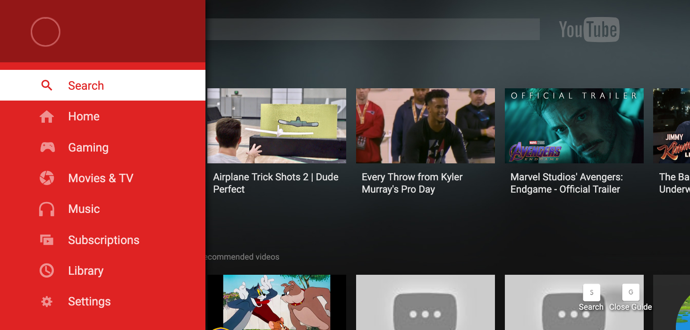
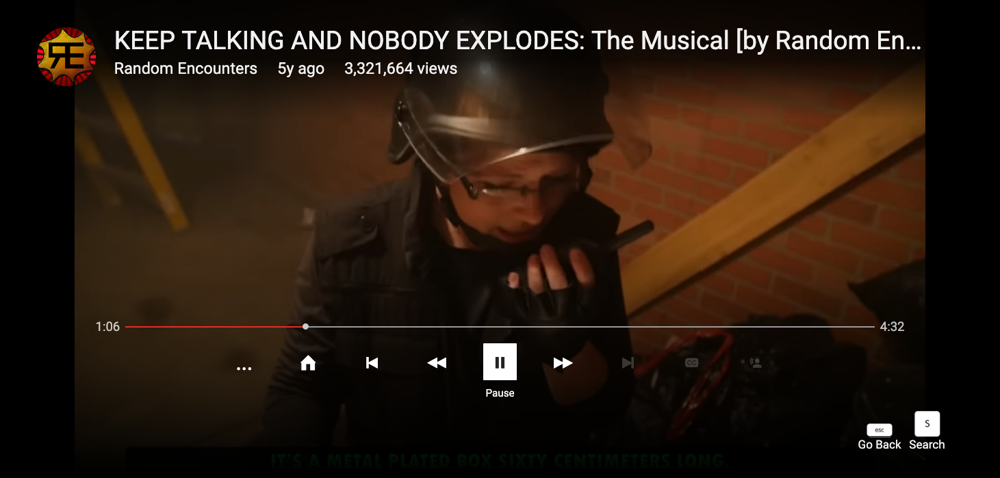
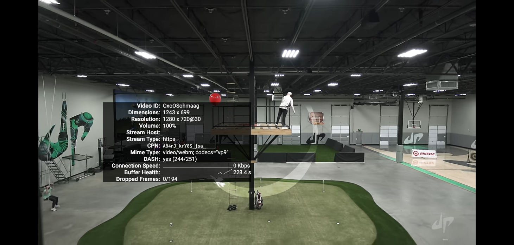
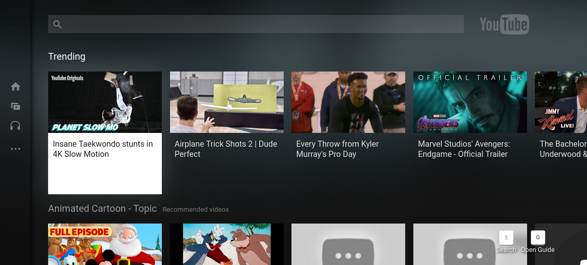

# 2016YouTubeTV

A project to revive the old 2015-2016 YouTubeTV HTML5 Web App.

## Screenshots

**[Note These Are As Of The 3rd Of February At 2:00 EST, Things Will Have Changed]**

## Credits

- YouTube/Google

- Erie Valley Software/Erievs

- youtube-dl-exec [https://github.com/microlinkhq/youtube-dl-exec] 

- cors-anywhere [https://github.com/Rob--W/cors-anywhere?tab=readme-ov-file]

- qr-code [https://www.npmjs.com/package/qrcode]

- dx for his knowlage 

- Venus5687 found a sound effect

## Before Posting An Issue!

- Do not hide your damn local ip adress, I have no idea why SO many people
do not know that a 192.168.1.blank or equivlient is not your public IP. I
cannot help you if you're hiding part of your screen.

- Do not report an issue if you modified the port or adress you're hosting this on
, you're on your own if you wanna host it on a different port.

## If You're Going To Host This

PLEASE disable Oauth, so just delete refrences to it in server.js, why 
because this is designed for someone to host themeselves and only themeselves
so I save your token/refresh token in a .json file.

## Cool Things To Know

- This doesn't need FFMPEG, videos are streamed straight from googlevideo link throw a CORS proxy! (idk if yt-dlp requires it
I don't think so, you only need it to merge formats iirc).

- This uses DASH formats, so this should work into the future (of course APIs may change, but the video playback is yt-dlp based
so it'll probbaly be fine).

- The TV Player uses a custom system for fetching videos, as I had troubles with the original MediaSource BS it uses, it 
used media-source but ran into too many issues with how the player set it up. So yeah this player script is quite modifed.

- This **should** support JavaScript ES5 now, before I used const and let and for a little time fetch(), now
it uses XHR for the custom MediaStream stuff. Which means now it can run on era appropriate smart devices, well
at least when I do IP adressed rather than localhost!

## Why We Use "youtube-dl-exec"

This is so we can get video urls, without having to deal with all the chiper bs you have
to deal with no  ** you will now need python3.7 or higher installed! though **

## Why We Use "qr-code"

Just to make qr codes for the google chart api implementation.

## Why We Use "cors-anywhere"

YouTube has CORS on their googlevideo links (I forgot which settings) and it will 
give a CORS error if you try to get it, luckly this exsits so googlevideo links
are all going to be filtered through port 8070!

## Info On Hosting

Right now we use localhost, I think I will change this at some point when I am done 
with finishing the app. Probbaly what YT2009 does, where you input your IP adress you
wanna use. 

I mean YOU can now but you'll have to modify each refrence of localhost to your IP adress,
I just used localhsot as it was easy to setup.

Disable Oauth for now, you won't need to in the future since i can just get your access 
token from the headers (I didn't think about that).

We Use:

- Port 8090

- Port 8070 

## Supported YouTube TV Clients

We only offically supprort 5.20150715 as of right now, however it seems like early 2018
and 2017 ones will work. Someone sort of got a 2018 version running!

## Clients I May Choose To Support In The Future ##

Client V4 (https://web.archive.org/web/20140517113435/https://www.youtube.com/tv#/?mode=search)

6.20180807 (https://web.archive.org/web/20180930120208/https://www.youtube.com/tv#/search?resume)

2019 - https://web.archive.org/web/20190301064917/https://www.youtube.com/tv#/search?resume (6.20180807)

(The guide api should work on the above one, since that's what we requested for the json data)

What Will Never Happen are clients that fully use GDATA, now there's a chance I may support client V4 as that uses 
innertube for search and stuff, but not fully GDATA ones. Just use YT2009 at that point!

## Setup

**[Note This Project Isn't Done, So Guide Won't Be Super Great]**

[Make sure you have nodejs, npm, and python3 (version 3.7.something or above!)]

- Step 1: run git clone https://github.com/erievs/2016YouTubeTV.git

- Step 2: run npm install

- Step 3: if you run into issues with youtube-exec, try running "npm install youtube-dl-exec --save"

- Step 4: run npm start, and you're done!

[When I say V, I mean the version of the YouTube App]

Progress Report
1. Search - 95% Done

    Status: Amost done just need to fix one thing.
    Next Steps: Instead of not dispalying info fully remove a crap video entry with no data.

2. Guide - 100% Done

    Status: Done
    Next None;

3. Browse/Channels - 70% Done

    Status: The Browse API (which is what channels use and the homepage and such), loads off a static json file but loads fine!
    Next Steps: Work on getting the data from the youtubei browse api and converting it into that format.

4a. Watch - 90% Done

    Status: Videos play, a tiny bit buggy somtimes **you need to play and pause and play again** for progress to work, but works.
    Next Steps: Make it less bugger and chunk less data.

    ** Right now SOME videos don't work, this is just because I haven't done the WebM to H264 fallback yet, it will be fixed **

4b. Watch Interactions - 100% Done

    Status: You can sub, unsub, like, and they'll all load.
    Next Steps: Nothing.

5. Pairing - 20% Done

    Status: Got some end points implemented, but they don't create the code.
    Next Steps: Get it to create the pairing code.

6. Sign In - 65% Done

    Status: Implemented /o/oauth2/code and it properly grabs the oauth code or whatever it is calle, and Implemented /o/oauth2/token!!
    Next Steps: Make it so the token can request the token more than 5 times (rn you have to be fast), do all the V3 urls.

7. Assets - 90% Done

    Status: Most of the assets are there, with a few missing sound files and 404 errors that need to be addressed.
    Next Steps: Find the missing assets and add em.

8. Other

-̶ ̶G̶e̶t̶ ̶i̶t̶ ̶t̶o̶ ̶l̶o̶a̶d̶ ̶t̶h̶e̶ ̶b̶a̶c̶k̶g̶r̶o̶u̶n̶d̶ ̶o̶n̶ ̶h̶o̶m̶e̶s̶c̶r̶e̶e̶n̶.̶

 ̶-̶ ̶M̶a̶k̶e̶ ̶l̶i̶v̶e̶.̶j̶s̶ ̶w̶o̶r̶k̶ ̶b̶e̶t̶t̶e̶r̶ ̶(̶i̶t̶ ̶s̶o̶m̶e̶t̶i̶m̶e̶s̶ ̶c̶a̶u̶s̶e̶s̶ ̶i̶s̶s̶u̶e̶s̶ ̶w̶i̶t̶h̶ ̶t̶h̶e̶ ̶g̶u̶i̶d̶e̶,̶ ̶h̶o̶w̶e̶v̶e̶r̶ ̶i̶t̶ ̶i̶s̶n̶'̶t̶ ̶t̶h̶e̶ ̶g̶u̶i̶d̶e̶s̶ ̶f̶a̶u̶l̶t̶.̶)̶

-̶ ̶F̶i̶x̶ ̶o̶l̶d̶e̶r̶ ̶b̶r̶o̶w̶s̶e̶r̶ ̶s̶u̶p̶p̶o̶r̶t̶,̶ ̶r̶i̶g̶h̶t̶ ̶n̶o̶w̶ ̶w̶e̶ ̶u̶s̶e̶ ̶s̶o̶m̶e̶ ̶t̶h̶i̶n̶g̶ ̶f̶r̶o̶m̶ ̶E̶C̶M̶A̶S̶c̶r̶i̶p̶t̶ ̶6̶ ̶a̶n̶d̶ ̶7̶,̶ ̶l̶i̶k̶e̶ ̶l̶e̶t̶ ̶a̶n̶d̶ ̶f̶e̶t̶c̶h̶ ̶I̶ ̶a̶m̶ ̶w̶o̶r̶k̶i̶n̶g̶ ̶o̶n̶ ̶s̶u̶p̶p̶o̶r̶t̶i̶n̶g̶ ̶b̶r̶o̶w̶s̶e̶r̶ ̶t̶h̶e̶ ̶o̶f̶f̶i̶c̶a̶l̶ ̶c̶l̶i̶e̶n̶t̶ ̶w̶o̶u̶l̶d̶.̶

- Make it so you can use an IP adress rather than localhost:8090 so you can use it on a real TV or something.

- Support other versions of YouTube TV

- Other languages

- Fix grammar

